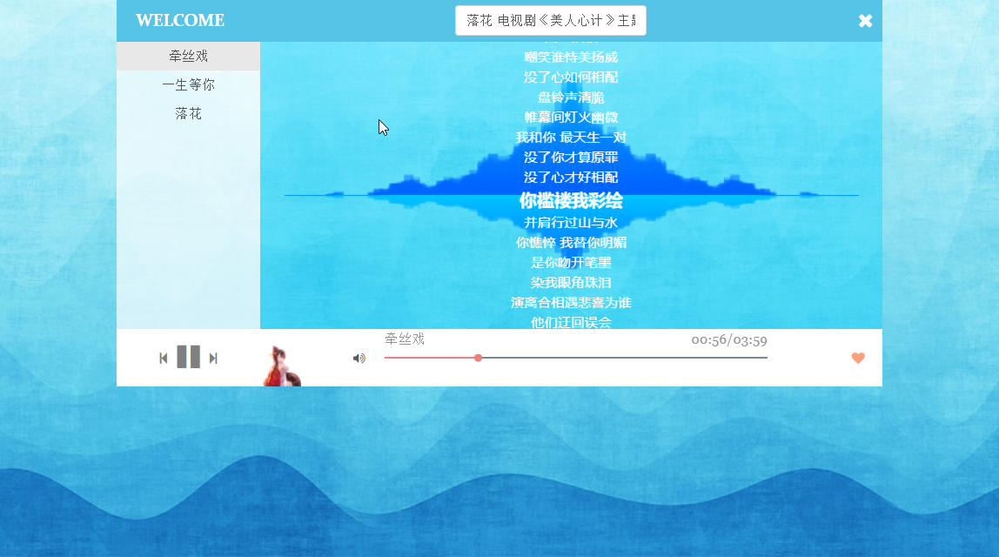

# 一个机遇umi创建的音乐webApp

## 预览

## UMI创建react项目
https://umijs.org/zh/guide/create-umi-app.html

## 音乐API
    百度音乐api接口 
    https://www.jianshu.com/p/a6718b11fdf1

    网易云音乐 API 
    https://api.imjad.cn/cloudmusic.md
    https://binaryify.github.io/NeteaseCloudMusicApi/#/

## Font Awesome
[一套绝佳的图标字体库和CSS框架](http://fontawesome.dashgame.com/)